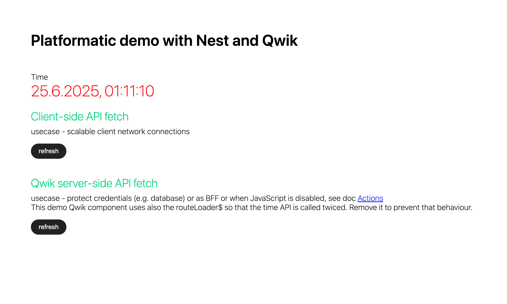

# Platformatic demo with Nest and Qwik



## Requirements

[Platformatic Runtime](https://docs.platformatic.dev/docs/runtime/overview) application.
Platformatic supports macOS, Linux and Windows ([WSL](https://docs.microsoft.com/windows/wsl/) recommended).
You'll need to have [Node.js](https://nodejs.org/) >= v22.16.0

## Setup

1. Install dependencies:

```bash
pnpm i
```

## Usage

Run the API with:

```bash
pnpm dev
```
or production
```bash
pnpm start
```

## Adding a Service

Adding a new service to this project is as simple as running `create-platformatic` again, like so:

```
pnpx create-platformatic
```
